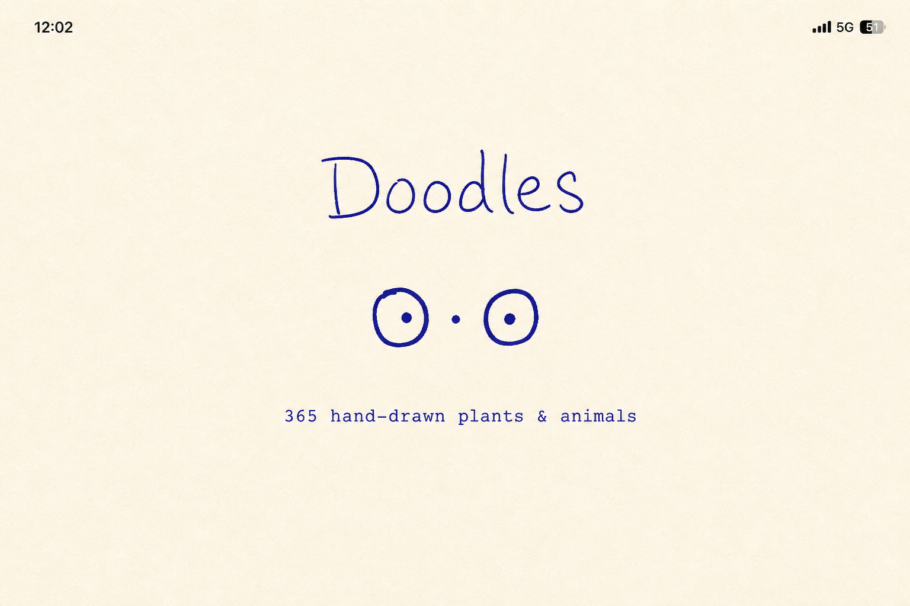
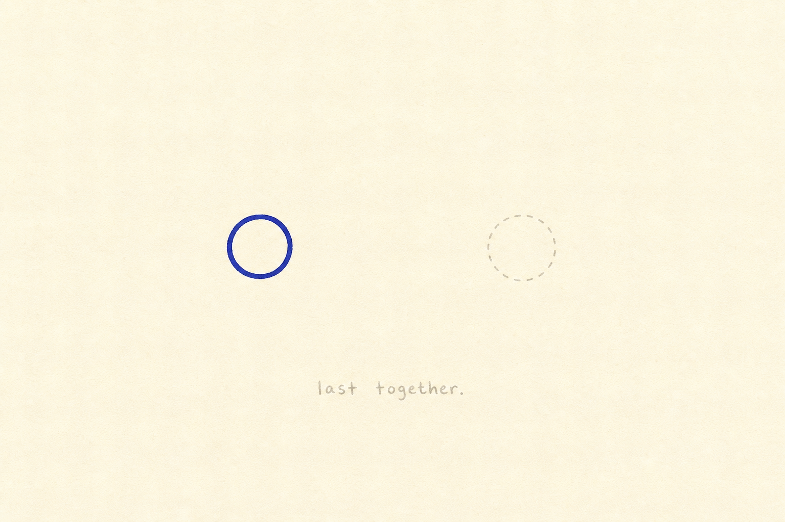
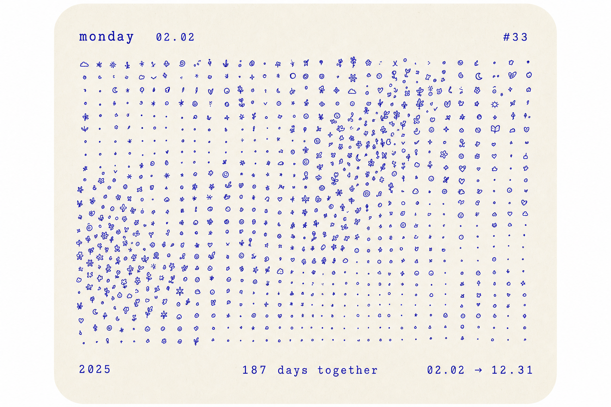

# Acue

> 一盏灯，一段共时——「我在，你也在。」

---

## 1. 一句话

**Acue** 是一款双人弱连接 App：用**灯**表达在场，用**触、印、字**传递信号与含义，安静记录「同时在场」的时光。App 只提供通道与原语；语义——摩尔斯、暗号、仪式——由你们自己定义。

---

## 2. 设计哲学：弱连接 · 轻交互 · 可延伸

### 弱连接

| 意味着 | 不意味着 |
|--------|----------|
| 在线是一种邀请，离线是自然状态 | 「你怎么不在线」的隐性压力 |
| 状态可见，但不需要回应 | 已读回执、回敲、确认收到 |
| 有期限的会话（8h）自动结束 | 24 小时互相监视 |
| 时间记录是「回忆」，不是 KPI | 连续打卡、成就、排行榜 |

### 轻交互

| 层级 | 交互 | 频率 |
|------|------|------|
| **零交互** | 灵动岛瞥见对方在线 · 共时累加 · 呼吸同步 · 余温渐灭 | 日常主力 |
| **一次交互** | 打开 App / 长按熄灯 | 想在场或离开时 |
| **原语交互** | 叩 · 拨 · 心跳 · 共振 | 偶尔 |
| **浏览交互** | 上滑看共时 / 信号 · 回放 · 跟敲 | 偶尔回顾 |

### 可延伸 · UGC 槽位

App 是**传输层**，不是**语义层**（不是 IM）。

- 系统忠实传递形态与时序，不解读、不解码
- 用户可在原语与槽位之上自行约定玩法
- 不填槽也完整可用

借鉴「拍一拍后缀」：**产品搭台，用户填语义**（见 §3.4 字通道 · 灯铭 / 词典）。

| 槽位 | 台子（App） | 戏（用户） |
|------|-------------|------------|
| **灯铭** | 灯下方一行字 | 在场时的自我表达 |
| **暗号词典** | 叩击序列形态 | 序列对应的私密含义 |
| **心境词典** | 灯态组合 | 光形态对应的心情名 |
| **叩击原语** | `·` `—` `··` 等 | 摩尔斯、仪式、暗号 |

---

## 3. 多通道信息架构

> **核心原则**：灯只管「在场」；主动信号、含义、瞬时表达可走其他通道。**不必把所有信息都翻译成灯效。**

### 3.1 为什么需要多通道

| 信息类型 | 仅用工「灯」的问题 | 更合适的通道 |
|----------|-------------------|--------------|
| 在不在、陪多久 | ✅ 灯最自然 | **灯** |
| 离散叩击、摩尔斯 | 灯闪易被忽略；盯屏才看见 | **触** + **印** |
| 含义、梗、昵称 | 光无法编码复杂语义 | **字** |
| 一次性「连你一下」 | 脉冲太离散 | **线**（可选） |
| 共时数字 | 本就不是灯 | **时**（已有） |

### 3.2 五通道总览

```
┌─────────────────────────────────────────────────┐
│  灯 · 在场层          亮灭 · 光质 · 共在感       │
├─────────────────────────────────────────────────┤
│  触 · 信号层          振动节奏（主）· 可选淡闪   │
│  印 · 系统展示层       灵动岛 / 锁屏 · 符号纹理  │
├─────────────────────────────────────────────────┤
│  字 · 表达层          灯铭 · 暗号/心境词典       │
├─────────────────────────────────────────────────┤
│  线 · 空间层（V0.3+）  一次性连线 · ephemeral    │
├─────────────────────────────────────────────────┤
│  时 · 记录层          共时轴 · 信号轴 · 时间戳   │
└─────────────────────────────────────────────────┘
```

各通道**并行、不互斥**；同一动作可触发多通道（如短叩 = 触 + 印 + 写入时）。

---

### 3.3 灯 · 在场层（Lamp）

**职责**：持续、被动、一眼瞥见——「你在不在」「我们有没有同在场」「气场如何」。

| 载体 | 内容 |
|------|------|
| 主页双灯 | 在线 · 心境光质（`LampState`）· 余温 |
| 灵动岛 | **单一光点** = 对方在线（不变） |
| Live Activity | 双灯 + 本次共时（MVP）；V0.2 可优化布局见 **印** |
| Widget | 光点状态 |

**灯不再承担**：离散信号的主反馈、文字含义、未读强提醒。

---

### 3.4 触 · 信号层（Haptic）

**职责**：主动脉冲的**主反馈通道**——口袋里有感，不必盯屏。

| 规则 | 说明 |
|------|------|
| 短叩 / 长叩 / 双指叩 / 拨灯 | 接收方 **Haptic 按序播放** 为主 |
| 灯闪 | **次要**：极淡闪一下或可不闪（V0.2 可配置「静默信号模式」） |
| 前台 / 后台 | 前台：触 + 可选淡闪；后台：触（若 App 存活）+ 必写 **时** 记录 |
| 与灯的关系 | 发送方对方灯仍可「已送达」微闪；接收方**自己的灯**随 Haptic 闪，非对方灯大闪 |

**A/B 可验证**：「触为主」vs「灯闪为主」对混淆率 / 盯屏率的影响（可与 §6.6 心境 A/B 独立）。

---

### 3.5 印 · 系统展示层（Glyph）

**职责**：灵动岛 / 锁屏 / Live Activity 上用**符号纹理**表达信号，而非第二盏灯或强提醒。

| 场景 | 在场（灯通道） | 信号（印通道） |
|------|----------------|----------------|
| 灵动岛紧凑态 | 单一暖色光点 | 有未读：光点旁极淡 `·` 纹理或微脉动；**不增第二图标** |
| Live Activity | 左侧：你的灯状态摘要 | 右侧：`···` / `— ·` 未读段数或最新序列缩略 |
| 锁屏 | 共时 + 一光点 | 未读段数用符号，不用红色角标 |

**设计约束**：

- 印 = **抽象符号**（`· — ~`），不是 emoji、不是气泡
- 不推送；用户打开 App 才完整感知
- 点击 Live Activity → 打开 App（MVP 不变）

**待确认**：Live Activity 是否从「对称双灯」改为「灯 + 印」不对称布局（V0.2 视觉 A/B）。

---

### 3.6 字 · 表达层（Text Slots）

**职责**：UGC 语义槽——App 不传含义，用户填。

| 槽位 | 挂载位置 | 版本 |
|------|----------|------|
| 灯铭 | 主页 · 自己灯下 | V0.2 |
| 暗号词典 | 信号记录 · 命中序列 | V0.2 |
| 心境词典 | 主页 · 命中 `LampState` | V0.2 |
| 信号本地昵称 | 单条记录 · 仅自己 | V0.2 |

**展示优先级**（信号页）：词典命中时 **字为主、`· —` 为辅**（小字 secondary）。

---

### 3.7 线 · 空间层（Thread · V0.3+ · 待确认）

**职责**：一次性空间表达——「这一刻连你一下」，不是脉冲，不是聊天。

| 规则 | 说明 |
|------|------|
| 操作 | 在两灯之间快速拖一条弧线 / 连线 |
| 持续 | 5–10s 后自动消失 |
| 存档 | 默认**不存档**；或仅记「某刻有过连线」无轨迹细节 |
| 与叩击 | 叩 = 离散时间序列；线 = 连续空间瞬间 |
| 与涂鸦 | 仅**一条**线，无颜色 / 无保存 / 无画布 |

---

### 3.8 时 · 记录层（Time）

**职责**：事后记忆，非实时互动通道。

| 类型 | 形态 |
|------|------|
| 共时 | `1h 08m` · 永久轴 |
| 信号 | `· — · ·` + 可选词典文案 |
| 时间戳 | 列表项必备 |

---

### 3.9 通道 × 版本矩阵

| 通道 | MVP | V0.2 | V0.3 |
|------|-----|------|------|
| 灯 | 双灯 · 灵动岛 · Live Activity | + 心境 · 余温 · 呼吸同步 | + 靠 · 隙（可选） |
| 触 | 闪振同播（灯闪为主） | **触为主、灯闪为辅** | + 静默信号模式 |
| 印 | 未读光环（主页） | 灵动岛 / Live Activity 符号化 | 优化布局 A/B |
| 字 | — | 灯铭 · 双词典 · 昵称 | — |
| 线 | — | — | 一次性连线 · 待确认 |
| 时 | 共时 + 信号轴 | + 里程碑 | 年度卡片 |

---

### 3.10 更新后的表达栈

```
时  共时轴 · 信号轴              ← 记录（事后）
线  一次性连线（V0.3+）          ← 空间（瞬间）
字  灯铭 · 词典 · 昵称           ← 语义（UGC）
印  灵动岛 / 锁屏符号             ← 系统瞥见（信号）
触  叩击 Haptic 序列             ← 主动信号（实时）
灯  亮灭 · 光质 · 共在           ← 在场（持续）
```

**分工口诀**：**灯陪着，触敲人，印瞥见，字懂意，线连一下，时记住。**

---

## 4. 产品决策（已确认）

| 项 | 决定 |
|----|------|
| 共时记录保留 | **永久**，双方本地 + 云端同步 |
| 离线主屏 | **显示**「上次同在 · 时间 · 时长」 |
| 轻叩 | **纳入 MVP**，点对方灯触发 |
| 灵动岛光点 | **单一光点**——亮 = 对方在线，暗 = 离开 |
| 入口结构 | **打开 App → 主页**；配对、记录、叩击均在此 |
| 后台行为 | **已配对时划出 App → 灵动岛 / Live Activity 接管** |
| 主动离线 | **长按自己灯 → 熄灯**，替代杀进程作为主要离开方式 |
| 交互原语 | **短叩 + 长叩**（MVP）；扩展原语见 §6.4 |
| 信号记录 | **永久保存**序列，支持回放；无已读回执 |
| 多通道架构 | **灯 / 触 / 印 / 字 / 线 / 时**；见 §3 |
| UGC 槽位 | 灯铭 · 暗号词典 · 心境词典 |
| 信号主反馈 | V0.2 起 **触（Haptic）为主**、灯闪为辅（可 A/B） |
| 心境手势 | 原子操作组合 → 灯态；方案 A/B/C 待 A/B · §6.6 |

---

## 5. App 生命周期

```
启动 App
  └─→ 主页
        ├─ 未配对 → 配对区（邀请码 / 扫码 / NFC 碰一碰 V0.2）
        └─ 已配对 → 双灯 · 共时 · 记录 · 叩击

划出 App（已配对）
  └─→ 维持在线，灵动岛 / Live Activity 接管
        ├─ 灵动岛：单一光点（对方在线 = 亮）
        └─ 锁屏：双灯 + 本次共时

长按自己灯 / 主动熄灯
  └─→ 灯 3s 渐灭，离线，共时写入记录

杀进程
  └─→ 同主动熄灯，灯灭离线
```

| 状态 | 你 | 对方看到 |
|------|----|----------|
| App 在前台 | 在线，主页可操作 | 灵动岛光点亮 |
| App 在后台 | 仍在线，Live Activity 运行 | 灵动岛光点亮 |
| 主动熄灯 / 杀进程 | 离线，灯 3s 渐灭 | 灵动岛光点渐灭 |

**首次配对引导**（一次性）：

> 「划出 App，灯会继续亮着。想离开时，长按你的灯。」

---

## 6. 交互原语体系

Acue 的互动由**原子原语**组合而成，分五类。**叩击族只是其中一类**——此外还有动自己灯、两灯空间关系、持续状态表达。

### 6.1 原语分类

```
状态原语     灯亮 · 灯灭
脉冲原语     短叩 · 长叩 · 双指叩 · 拨灯        ← 叩击族 · 对方灯
自我原语     心跳 · 遮 · 温/明/息 shift · 熄灯   ← 自己灯 · 组合 = 心境
空间原语     靠 · 共振 · 呼吸同步 · 余温
UGC 槽位     灯铭 · 暗号词典 · 心境词典
```

**新增原子的判断标准**：① 一种手势对应一种可识别形态；② 不玩的用户无感；③ 不引入「必须回复」；④ 最好能用现有反馈维度（光 / 触 / 时序）表达。

### 6.2 完整交互地图

| 原语 | 操作 | 对象 | 入信号记录 | 版本 |
|------|------|------|------------|------|
| 灯亮 | 打开 / 划出 | 自己 | — | MVP |
| 灯灭 | 长按自己灯 | 自己 | — | MVP |
| 短叩 | 点 | 对方灯 | ✓ `·` | MVP |
| 长叩 | 长按 | 对方灯 | ✓ `—` | MVP |
| 共时 / 回放 / 浏览 | — | — | 共时轴 / 信号轴 | MVP |
| 心跳 | 点 | 自己灯 | — | V0.2 |
| 余温 / 呼吸同步 | 自动 | 双灯 | — | V0.2 |
| 灯铭 / 暗号词典 / 心境词典 | 编辑槽位 | — | 展示层 | V0.2 |
| **心境 shift** | 双击/三击/四击自己灯 | 自己灯 | — | V0.2 |
| 遮 | 按住自己灯 1s 松手 | 自己灯 | — | V0.2 |
| 拨灯 | 轻扫 | 对方灯 | ✓ `~` | V0.3 |
| 双指叩 | 双指点 | 对方灯 | ✓ `··` | V0.3 |
| 靠 | 拖自己灯向对方 | 空间 | — | V0.3 |
| 重发 | Widget / 双指短叩自己灯 | 自我 | ✓ 复用 | V0.3 |
| 共振 | 1s 内双方各叩 | 空间 | — | V0.3 |
| Widget 叩 | 点小组件 | 对方 | ✓ | V0.3 |
| NFC 配对 | 碰一碰 | — | — | V0.2 |

### 6.3 MVP 原语（V0.1）

| 原语 | 操作 | 传递内容 | 接收反馈 |
|------|------|----------|----------|
| **灯亮** | 打开 App / 划出后台 | 在线状态 | 对方灵动岛光点亮 |
| **灯灭** | 长按自己灯 / 杀进程 | 离线状态 | 对方光点 3s 渐灭 |
| **短叩** | 点对方灯 | 一次短脉冲 | 灯闪 + soft Haptic |
| **长叩** | 长按对方灯 ~0.6s | 一次长脉冲 | 灯长闪 + medium Haptic |

**时序保真**：连续叩击按真实间隔传递，间隔本身成为信息载体。

**频率限制**：单方向 30 秒内最多 8 次脉冲原语（短/长/双指/拨）；触顶时发送方自己的灯微暗，无文字提示。

### 6.4 扩展原语详解

#### 叩击族（脉冲 · 对方灯）

| 原语 | 符号 | 操作 | 反馈 |
|------|------|------|------|
| 短叩 | `·` | 点对方灯 | 短闪 + soft Haptic |
| 长叩 | `—` | 长按对方灯 | 长闪 + medium Haptic |
| 双指叩 | `··` | 双指点对方灯 | 双短闪 + soft×2 |
| 拨灯 | `~` | 轻扫对方灯 | 灯微晃 + light Haptic |

连续叩击按真实间隔传递；间隔本身是信息载体。均写入信号记录，可匹配暗号词典。

#### 自我族（自己的灯 · V0.2+）

**自己灯与对方灯的手势完全分离**——点对方 = 发信号；点自己 = 表达心境 / 调节灯态。

> 具体手势映射见 **§6.6 方案 A / B / C**，三套并行记录，**待 A/B 测试后定稿**。下表以方案 A 为例说明数据结构，非最终交互。

| 原语（方案 A 示例） | 操作 | 效果 | 持久 | 入信号记录 |
|------|------|------|------|------------|
| **心跳** | 点自己灯 | 呼吸加快 3s | 瞬时 | 否 |
| **温 shift** | 双击自己灯 | 色温 3 档循环 | ✓ | 否 |
| **明 shift** | 三击自己灯 | 明度 3 档循环 | ✓ | 否 |
| **息 shift** | 四击自己灯 | 呼吸节奏 3 档循环 | ✓ | 否 |
| **遮** | 按住自己灯 1s 后松手 | 半暗开关 | ✓ | 否 |
| **熄灯** | 长按自己灯 ~2s | 离场渐灭 | — | 否 |
| **重发** | 双指短叩自己灯（V0.3） | 重发上一段脉冲给对方 | — | 是 |

**当前心境** = 持久维度的 `LampState` 组合，实时同步给对方（无历史）。方案 B/C 通过不同手势达到同一数据结构。

**心跳 vs 短叩**：心跳是瞬时波动；短叩是发给对方的脉冲信号。

**遮 vs 熄灯**：按住 1s 松手 = 遮；持续长按至 ~2s = 熄灯。

#### 空间族（两灯关系 · V0.2+）

| 原语 | 操作 | 效果 |
|------|------|------|
| **呼吸同步** | 自动（双方同亮） | 两灯同频呼吸 |
| **余温** | 自动（对方离线） | 对方灯 3–5min 极慢渐灭 |
| **靠** | 拖自己灯向对方后松手 | 灯飘向对方再弹回，一次性 |
| **共振** | 1s 内双方各叩对方灯 | 两灯同步特殊闪，彩蛋 |

### 6.5 UGC 槽位 · 灯铭 & 暗号词典（V0.2）

> 逻辑参考微信拍一拍：**系统只报原语，用户填语义**。但不是聊天后缀，而是两个独立槽位。

#### 灯铭 · Lamp Caption

每人可在**自己灯下方**设一行短文案，对方主页可见。

```
      ○          ○
   「熬夜中」    「等你回」
```

| 规则 | 说明 |
|------|------|
| 字数 | 4–12 字（中文）/ 24 字符（英文） |
| 可见 | 仅配对对象，不外传 |
| 编辑 | 点自己灯铭区域 → 极简输入 → 保存 |
| 性质 | **自我表达**，不是发给对方的消息 |
| 默认 | 空；空时只显示灯 |

**与拍一拍的同构**：拍一拍 = 动作 + 可编辑后缀；Acue = 灯 + 可编辑铭牌。铭牌常驻，不随每次叩击变化。

#### 暗号词典 · Cipher Dictionary

双人共享一张**序列 → 含义**对照表。App **只展示映射**，不做摩尔斯编解码。

**编辑入口**：设置（角落）→ 暗号词典 → 添加条目

```
序列            含义（你们自己填）
· · ·          拍了拍你的狗头
— · —          我到家了
· — · · —      晚安
```

**收到信号时的展示**（信号页）：

```
昨天 23:05   · · ·
             拍了拍你的狗头        ← 命中词典则显示；未命中只显示序列
```

| 规则 | 说明 |
|------|------|
| 条目上限 | 50 条（防膨胀） |
| 同步 | 双方云端同步，仅两人可见 |
| 冲突 | 同一序列后写覆盖先写 |
| App 不做 | 自动翻译、梗库推荐、公开分享 |

**与灯铭的分工**：

| 槽位 | 时机 | 回答的问题 |
|------|------|------------|
| 灯铭 | 在场时持续可见 | 「我现在是什么状态」 |
| 暗号词典 | 收到叩击时 | 「这段节奏对我们意味着什么」 |
| 心境词典 | 看到对方灯态组合时 | 「这个光对我们意味着什么心情」 |

#### 信号本地昵称（补充）

接收方可给**某条历史记录**贴私密备注（仅自己可见），与词典不同——词典是规则，昵称是一次性回忆标注。

#### 心境词典 · Mood Atlas（V0.2 · 可选）

> **不做轮盘、不做 emoji 选择器。** 心境只通过 §6.4 自我族原子操作调节；词典仅用于给「灯态组合」贴名字。

**灯态向量**（App 定义，4 维）：

```
LampState { warmth: 1–3, brightness: 1–3, breath: slow|normal|fast, shaded: Bool }
```

**用户可选**：在心境词典里为常见组合命名，仅作展示辅助：

```
暖2 · 暗1 · 慢 · 遮开     →  「累了」
暖3 · 明3 · 快 · 遮关     →  「超想你」
```

对方主页：看见**光的形态**；若组合命中词典，灯下方淡显预设名（可关）。

| 规则 | 说明 |
|------|------|
| 切换方式 | **仅原子操作**，见 §6.6（方案 A/B/C 待 A/B 验证） |
| 不做 | 轮盘、列表点选、emoji、心情时间轴 |
| 不做 | 「对方心情变了」推送 |
| 不做 | 心情历史 / 曲线 / 问责文案 |
| 默认 | 全维默认档 = 「 plain 在场」 |

### 6.6 心境灯态 · 交互方案（待确认 · 计划 A/B）

**共识**：心情通过**自己灯上的原子操作**表达；对方读的是**持续灯态**（`LampState`），不是一次性通知。

**不做**：轮盘、下拉、emoji 面板、App 内置「开心/难过」。

**状态**：方案 A / B / C **均保留**，不设默认倾向；V0.2 末通过 **A/B 测试** 选定默认方案。

---

#### 方案 A · 维度叠加

每个原子操作只调节**一个持久维度**，多击次数区分（均在**自己灯**上）：

```
点一下      →  心跳（瞬时，3s，不改变心境）
双击        →  温 shift   （色温 ○○● 循环）
三击        →  明 shift   （明度 ○○● 循环）
四击        →  息 shift   （呼吸节奏循环）
按住 1s 松手 →  遮 toggle  （半暗开/关）
长按 ~2s    →  熄灯
```

| 维度 | 评估 |
|------|------|
| 优点 | 手势与维度一一对应；组合自由度高；误触相对低 |
| 缺点 | 四击学习成本；需防误触（建议四击间隔 < 400ms） |
| A/B 假设 | 适合愿意「调光」的用户；表达力最强 |

---

#### 方案 B · 自灯序列

在**自己灯**上敲短/长序列（规则同脉冲族，对象是自己），一段序列映射**心境词典**里的一条 `LampState` 预设：

```
自己灯上：· · —   →  跳到预设「累了」
```

| 维度 | 评估 |
|------|------|
| 优点 | 与暗号 / 摩尔斯同构；离散预设好记；玩法向用户友好 |
| 缺点 | 易与「发给对方的叩击」混淆；需强 UI 区分（自己灯闪 = 调心境） |
| 待决 | 序列「直接跳预设」vs「逐步调维度」 |
| A/B 假设 | 适合已玩暗号的用户；上手曲线陡但粘性高 |

---

#### 方案 C · 对称双通道

自己灯复用与对方灯**相同的脉冲形态**，但**语义不同**：

| 操作 | 对方灯 | 自己灯 |
|------|--------|--------|
| 点 | 短叩 `·` | 心跳（瞬时） |
| 长按 | 长叩 `—` | 遮 toggle |
| 双指点 | 双指叩 `··` | 温 shift 循环 |

明度 / 呼吸档：三击 / 四击补充，或并入长按时长分级（待原型验证）。

| 维度 | 评估 |
|------|------|
| 优点 | 「点谁就是对谁」心智最简单 |
| 缺点 | 长按在两边语义不同；误触风险中等 |
| A/B 假设 | 适合低学习成本优先的场景 |

---

#### 方案对比（待数据验证）

| | A 维度叠加 | B 自灯序列 | C 对称双通道 |
|--|-----------|-----------|-------------|
| 学习成本 | 中 | 高 | **低** |
| 与叩击族关系 | 并行独立 | 统一形态 | 镜像语义 |
| 误触风险 | **低** | 中 | 中 |
| 表达力 | **连续调光** | 离散预设 | 中 |
| 开发成本 | 中 | 中（+序列解析） | 低 |
| 当前状态 | 待 A/B | 待 A/B | 待 A/B |

---

#### A/B 测试计划（V0.2 末）

**目标**：选定默认心境交互方案，或决定「设置中可切换方案」。

**分层实现**（降低试错成本）：

```
Layer 1（共用）   LampState 数据结构 + 同步 + 对方渲染 + 心境词典
Layer 2（可切换） GestureMapper：A | B | C 三套手势映射
Layer 3（实验）   FeatureFlag `mood_interaction_variant`
```

**分流**：

| 组 | 方案 | 占比（建议） |
|----|------|--------------|
| control-A | 维度叠加 | 34% |
| variant-B | 自灯序列 | 33% |
| variant-C | 对称双通道 | 33% |

新配对用户入组；已配对用户不强制切换（或配对时一次性随机）。

**核心指标**（轻量，不做增长黑客）：

| 指标 | 说明 | 方向 |
|------|------|------|
| **心境使用率** | 7 天内至少调过 1 次 LampState | 高更好 |
| **误触率** | 自我手势后 5s 内撤销 / 反向操作 | 低更好 |
| **混淆率** | 本意图调心境却触发对对方叩击（日志判定） | 低更好 |
| **留存辅助** | 7 日仍亮灯 | 参考 |
| **定性** | 可选极简问卷（1 题）：「调心情顺不顺？」 | 辅助 |

**周期**：每方案至少 **200 对配对用户 · 2 周** 再决策（样本量可随实际调整）。

**决策输出**：

1. 默认方案（A / B / C 之一）  
2. 是否保留「高级 → 切换交互模式」入口  
3. 未胜选方案是否进入 V0.3 作为「玩法模式」  

---

#### 待确认项（A/B 前后）

- [ ] 遮 vs 熄灯时长分界（1s / 2s）  
- [ ] 心境词典与灯态同步上线，还是先灯态后命名  
- [ ] 首次调节是否给一次性原子提示（非教程）  
- [ ] A/B 分流比例与最小样本量  
- [ ] 胜选方案定稿后是否废弃其余 Mapper 代码  

### 6.7 信号留存 · 异步送达

接收方不可能时时盯着屏幕。叩击有两条送达路径：

```
发送方叩击
  ├─ 接收方 App 在前台  →  实时灯闪 + Haptic + 写入信号记录
  └─ 接收方未在看        →  仅写入信号记录，待打开 App 后感知
```

**分段规则**：连续叩击间隔 < 2.5s 视为同一段；超过 2.5s 静默则切段。

**打开 App 时（有未读信号）**：

1. 对方灯旁极淡未读光环（非红色角标）
2. 你的灯自动回放最新一段未读序列（一次）
3. 回放结束，该段本地标记已看——**不上传，发送方不可见**

**不是 IM**：信号记录是**留声机**，不是聊天框。灯铭/词典是**槽位**，不是对话线程。

### 6.8 用户延伸玩法（App 不参与语义定义）

App 不提供摩尔斯键盘、暗号词典或玩法教程。以下为**用户自发约定**的示例：

#### 暗号与编码

| 玩法 | 原语组合 | 说明 |
|------|----------|------|
| **摩尔斯电码** | 短叩 = · ，长叩 = — | 如 `— — · ·` = M；双方私下约定 |
| **暗号本** | 任意序列 ↔ 含义 | 可用 App 内**暗号词典**正式承载 |
| **摩尔斯「每日一字」** | 每天发一个字母 | 连起来是一句话，慢递情书 |
| **固定仪式** | 短叩 × 3 | 「到家了」「我困了」「晚安」 |
| **和解信号** | 特定序列如 `· — ·` | 吵架后不想说话，但想传信号 |

#### 节奏与游戏

| 玩法 | 说明 |
|------|------|
| **节拍传情** | 短-短-长-短，类似心跳，无需文字 |
| **异步节奏接龙** | A 发一段节奏，B 看到后回一段——即兴二重奏 |
| **呼与应** | `— — —` = 在吗？可回 `·` = 在，也可不回 |
| **剪刀石头布（异步）** | 短叩=石头，长叩=布，约定规则后各发一段，次日揭晓 |
| **叩而不回** | 发完即走，接收方无需回应——弱连接不变 |

**设计边界**：

| App 做 | App 不做 |
|--------|----------|
| 保真传递原语与时序 | 摩尔斯自动编解码 |
| 离线留存 + 信号记录 + 回放 | 推送「对方叩了你」 |
| **灯铭 + 暗号词典 + 心境词典** | 自由文本聊天 / 轮盘选心情 |
| 接收端灯闪 + Haptic | 已读回执 / 请回叩 |
| 信号本地昵称 | 玩法攻略、成就、排行榜 |

---

## 7. 核心功能

### 6.1 灯 · 在线状态

**主页视觉**：纯黑背景，两盏暖色呼吸发光圆，安静并排。

- **离线渐灭**（MVP）：对方离开，灯 3s 渐灭
- **余温渐灭**（V0.2）：渐灭过程延长至 3–5 分钟
- **同亮呼吸同步**（V0.2）：双方同在场，两灯同频
- **灵动岛**：单一光点，亮 = 对方在线，暗 = 离开
- **锁屏 Live Activity**：双灯 + 本次共时
- **8 小时会话**：到期自然熄灭，共时写入，不推送

### 6.2 时 · 共时记录

只记录**双方同时在线**的重叠时段。

**主屏信息优先级**：

```
1. 双方同亮  →  「共时 47 分钟」
2. 否则       →  「上次同在 昨天 23:14 · 1h 08m」
3. 无历史     →  仅双灯，无文字
```

**共时列表**（上滑）：永久保留，按年/月分组折叠，自然周汇总。

#### 共时增强（V0.2+）

| 能力 | 说明 |
|------|------|
| **共时里程碑** | 时间轴自然标注第一次：首次超过 1h、首次跨过午夜等；非 streak、非成就 |
| **同时在瞬间** | 整点 / 跨日 / 配对纪念日，两灯极淡闪一下；无弹窗、无推送，仅同在场可见 |
| **年度共时卡片** | 年底生成极简黑底图：总共时、最长一次、收到信号段数；可分享，不排行榜 |

### 6.3 叩 · 主动信号

**点对方灯 → 短叩** · **长按对方灯 → 长叩**

- 接收方在前台：灯闪 + Haptic，无回叩按钮
- 接收方不在看：写入信号记录，打开 App 后回放
- 发送方：对方灯短暂闪一下表「已送达」（不代表已看）

### 6.4 信号 · 叩击记录

永久保存**收到**的叩击序列。

```
今天 14:32        · — · · —
昨天 23:05        · · ·
6/25  00:18       — · — — · —
```

- 点击 → 灯上回放
- 发送方看不到对方是否已看

#### 信号增强（V0.2+）

| 能力 | 说明 |
|------|------|
| **信号本地昵称** | 给某条记录贴私密备注（仅自己可见），如 `· · ·` →「那晚的晚安」 |
| **回放跟敲** | 回放时可跟着敲一遍；系统比对节奏相似度，仅自己可见淡指示 |

**与共时的区别**：

| | 共时 | 信号 |
|--|------|------|
| 内容 | 双方同亮的时间段 | 对方发来的叩击序列 |
| 触发 | 自动 | 对方主动 |
| 形态 | `1h 08m` | `· — · ·` |
| 情感 | 「我们在一起待了多久」 | 「ta 敲了什么给我」 |

### 6.5 境 · 心境灯态（V0.2 · 待 A/B 定稿）

见 §6.4 自我族 + §6.6 交互方案。对方在你的主页上看见你**当前灯的形态**；可选命中**心境词典**显示命名。

**表达栈** → 见 **§3.10 多通道表达栈**（灯 / 触 / 印 / 字 / 线 / 时）。

### 6.6 铭 · UGC 槽位（V0.2）

见 §6.5。灯铭 · 暗号词典 · 心境词典；均为可选槽位。

---

## 8. 使用场景想象

产品故事与 onboarding 参考，非强制功能。

| 场景 | 用法 |
|------|------|
| **挂灯陪伴** | 一方加班，另一方划出 App 亮灯各做各事；事后共时记录：「那夜你陪了我 2 小时」 |
| **迟到的回响** | 早上打开 App，回放昨晚信号，补发一个 `·`——不用说话，但算回应（发送方仍看不到已读） |
| **异地时差灯** | 白天亮灯，对方深夜看到光点：「我这边太阳很好，想到你」 |
| **吵架模式** | 吵完不想说话但不想断联——只亮灯，不叩；共时记录：「沉默地同亮了 40 分钟」 |
| **用灯表达心情** | 加班时调暗 + 慢呼吸；对方打开看到「灯暗暗的」，不必问「你怎么了」 |

---

## 9. 系统层扩展

| 方式 | 说明 | 版本 |
|------|------|------|
| **Widget** | 瞥见对方在线状态；V0.3 可点按发短叩 | V0.2 / V0.3 |
| **Live Activity 点击** | 打开 App，不在锁屏发信号 | MVP |
| **NFC 碰一碰** | 首次配对仪式，两机相触绑定 | V0.2 |
| **快捷指令 / Action Button** | 「亮灯」「短叩一次」 | V0.3 可选 |

**不做**：推送通知、语音、文字快捷回复——均会滑向 IM。

---

## 10. 界面设计 · iOS 原型

> **可运行原型**：`acc/Acue/` Xcode 工程 · SwiftUI · 深色模式。右上角 hex 菜单可切换 6 种界面态。

### 10.1 设计原则（对齐 iOS HIG）

| 原则 | Acue 做法 |
|------|-------------|
| **Clarity** | 纯黑底 + 两盏灯为唯一焦点；信息分层 |
| **Deference** | UI 退后；无 Tab、无 heavy chrome |
| **Depth** | 记录用 Sheet（`.medium` / `.large`） |
| **Native** | SF Pro · Segmented · insetGrouped List · Material Toast |
| **Dark First** | 全程深色；琥珀为唯一强调色 |

### 10.2 布局网格

- 两灯间距 **48pt**，灯径 **88pt**，触控热区 **120pt**
- 灯垂直居中偏上；底部「⌃ 共时 / 信号」为上滑入口
- 共时 / 同在文案：**15pt Ultralight Rounded · monospacedDigit · 40% 白**

### 10.3 界面态（6 态 · 单页无 Tab）

未配对 · 双方同亮 · 仅你在 · 仅对方在 · 非共亮 · 未读信号

### 10.4 组件

| 组件 | 规范 |
|------|------|
| GlowLamp → **SymbolEndpoint** | 墨蓝手绘圆 + 瞳点 · 离线=铅笔虚线留空位 · 呼吸 0.97–1.03 |
| 离线灯 | 空心圆 72% · 1pt · 24% 白 |
| 未读光环 | 琥珀 stroke 25% · 慢脉动 |
| 灯铭 | 13pt Ultralight · 「」包裹 |

### 10.5 原型手势

点对方灯 = 短叩 · 长按 = 长叩 · 点自己 = 心跳 · 长按自己 = 熄灯 · 底部 = Sheet

### 10.6 代码结构

`Design/` · `Models/PrototypeStore.swift` · `Components/SymbolViews` · `Views/` · `PrototypeMenu`（调试，正式版移除）

---

## 11. 主页结构

唯一界面。无 Tab。

**已配对 · 同亮态（含灯铭 + 心境）**

```
┌─────────────────────────┐
│                         │
│      ○          ○       │  ← 左：暖2·暗1·慢（对方可见形态）
│   「累了」     「等你回」  │  ← 上：心境词典命中 / 灯铭
│                         │
│      共时 47 分钟        │
│      ↑ 上滑 共时 / 信号  │
└─────────────────────────┘
```

**自己灯手势**：见 §6.6 方案 A / B / C（**待 A/B 确认**，原型期可实现 `GestureMapper` 切换）

| 方案 | 自己灯（摘要） |
|------|----------------|
| A | 点=心跳 · 双击=温 · 三击=明 · 四击=息 · 按住=遮 · 长按=熄 |
| B | 在自己灯上敲序列 → 跳预设 LampState |
| C | 点=心跳 · 长按=遮 · 双指=温（对方灯同形不同义） |

**对方灯**（三方案共用）：点 = 短叩 · 长按 = 长叩 · 扫 = 拨灯（V0.3）

**已配对 · 有未读信号**

```
┌─────────────────────────┐
│      ○       ◌○         │  ← 未读淡光环
│  上次同在 昨天 23:14 · 1h 08m │
│      ↑ 上滑 共时 / 信号  │
└─────────────────────────┘
```

打开时灯自动回放最新未读序列一次。

**上滑 · 记录面板**

```
┌─────────────────────────┐
│    共时  │  信号          │
├─────────────────────────┤
│  昨天 23:05   · · ·        │
│               拍了拍你的狗头 │  ← 暗号词典（V0.2）
│  点击条目 → 回放 / 跟敲     │
└─────────────────────────┘
```

---

## 12. 交互谱系总览

```
┌──────────────────────────────────────────────────┐
│  零交互 · 瞥见（~90%）                            │
│  灯：灵动岛光点 · Live Activity · 共时累加        │
│  印：锁屏 / 岛上符号纹理（V0.2）                  │
├──────────────────────────────────────────────────┤
│  主动交互（偶尔）                                  │
│  触：叩击 Haptic 序列（V0.2 为主通道）            │
│  灯：在场 · 心境 shift / 遮 / 熄灯               │
│  线：一次性连线（V0.3+ · 待确认）                 │
│  原语：脉冲 / 自我 / 空间 · 见 §6                │
├──────────────────────────────────────────────────┤
│  UGC · 字（V0.2）                                │
│  灯铭 · 暗号词典 · 心境词典 · 信号昵称            │
├──────────────────────────────────────────────────┤
│  浏览 · 时                                       │
│  共时轴 · 信号轴 · 回放 · 跟敲 · 里程碑          │
└──────────────────────────────────────────────────┘
```

---

## 13. 刻意不做

| 方向 | 原因 |
|------|------|
| 实时涂鸦 / 你画我猜 | 变 IM，复杂度高 |
| 所有信息都绑灯闪 | 盯屏负担 · 信号与在场混淆 |
| 语音 / 图片 / emoji 面板 | IM |
| 轮盘 / emoji 选心情 | 破坏原子操作逻辑；变 IM |
| 对方离线 N 天提醒 | 问责，破坏弱连接 |
| 信号 / 共时排行榜 | KPI 化 |
| streak / 成就解锁 | 时间记录变打卡 |
| 单方在线时长可见 | 监控感 |
| 推送「对方叩了你」 | 强索取注意力（V0.2 可选静默本地通知，默认关） |
| 灵动岛扩展态 + 快捷按钮 | 与单一光点原则冲突 |

---

## 14. 版本路线图

### V0.1 · MVP

主页 · 配对 · 双灯 · 共时 · 短叩/长叩 · 信号记录 · 灵动岛 · Live Activity · 首次引导

### V0.2 · 情感 + UGC + 多通道

**灯**：`LampState` · 余温 · 呼吸同步 · 心境 A/B（§6.6）

**触 + 印**：Haptic 为主反馈 · 灵动岛 / Live Activity 符号化未读（§3.5）

**字**：灯铭 · 暗号词典 · 心境词典 · 信号昵称 · 回放跟敲

**时**：共时里程碑 · NFC · Widget

### V0.2.1 · A/B 结论

心境手势方案（§6.6）· 触 vs 灯闪主反馈 · Live Activity 布局（可选）

### V0.3 · 玩法 + 空间

拨灯 · 双指叩 · 靠 · 重发 · 共振 · **线（一次性连线 · §3.7）** · Widget 叩 · 快捷指令

### V0.4 · 回忆层

年度共时卡片 · 共时/信号导出为极简分享图

---

## 15. 设计语言

| 维度 | 规范 |
|------|------|
| **连接强度** | 弱连接——可见但不索取 |
| **交互密度** | 轻交互——默认零操作 |
| **可延伸性** | 原语极简，语义归用户 |
| **色调** | 纯黑 + 暖琥珀 `#FFB347 → #FF8C00` |
| **动效** | 灯亮 1.5s · 灯灭 3s · 短叩 0.15s · 长叩 0.4s · 余温 3–5min 渐灭 |
| **字体** | SF Pro Ultralight；时间等宽 40% 白 |
| **声音** | 全程静音 |
| **多通道** | 灯 = 在场 · 触 = 信号 · 印 = 系统瞥见 · 字 = UGC |
| **触感** | 触通道：短叩 `.soft` · 长叩 `.medium` · 拨灯 `.light` |
| **气质** | 深夜 · 安静 · 私密 · 不打扰 · 不问责 |

> 注：以下 **15.1** 是 V0.2+ 正在探索的**候选视觉语言**，与上表「夜 + 暖光灯」并行记录，尚未最终替换。两套语言共享同一套通道模型（灯 / 触 / 印 / 字 / 时），只是「在场」的视觉母题不同。

### 15.1 视觉语言探索（v1）· 纸上的双端点符号

**动机**：单一「灯」只有亮度一个主维度，表达力有限，且光效在陪伴类产品里偏常见。把「在场」从一盏灯，升级为一套**有语法的手绘符号系统**——既保留弱连接的克制，又把信息维度扩到形状、连接、颜色、墨色、节奏、形变。

#### 核心：一张纸上的三槽语法

```
   [ 我 ]   ·   [ 你 ]
```

两个**同源的手绘端点**并排，中间是**连接符**。形如颜文字（`o.o` `o_o`），但**不是表情**——两个 `o` 天然是「一对、对等」（同在），左右各自可变又是「两个独立个体」，中间字符表达此刻的连接状态。

| 槽位 | 含义 | 形态示例 |
|------|------|----------|
| 左端点 | 我的在场 + 心境 | `o` `⊙` `^` `~` `-` |
| 连接符 | 共时 / 连接强度 | `(空)` `·` `_` `—` |
| 右端点 | 你的在场 + 心境 | 同左，镜像 |

#### 三条铁律（守住「语义留白」）

1. **永不给符号贴情绪标签**——界面无「开心/难过」字样，不做情绪选择器，只给**笔画元件**让用户自由拼。
2. **系统只忠实传输形态，不翻译**——`o_o` 对系统无含义，原样递过去，含义在两人心里。
3. **私有约定 = 「字」通道载体**——两人可自定 `o~o`=「我想你了」，即暗号词典。别人看不懂，正是弱连接的浪漫。

**抽象符号库（无标签 · 纯元件）**：

```
端点（眼）：  o   O   ⊙   ·   ^   ˇ   -   ~   ×   *
连接（中间）：(空)   .   ·   _   —   ~   :   =
自由拼：  o.o   o_o   o o   -.-   ^.^   o~o   ×_×   ·.·
```

#### 六个信息维度 → 纸墨表达

| 维度 | 表达方式 |
|------|----------|
| **形状** | 端点笔画形态（用户捏出的「眼」） |
| **连接符** | 随**共时累积**从 `·` → `_` → `—` 缓慢「生长」（客观时长痕迹，非情绪） |
| **颜色** | 平时墨蓝/石墨灰单色；心境给符号上色，仅色温、无标签 |
| **墨色明暗** | 刚活跃→墨色饱满；久未动→变淡发灰 |
| **眨眼 = 叩** | 一滴墨在对方位置轻点、晕开又收 + Haptic |
| **形变强度** | 心境烈度 = 笔触抖动；平静线条稳，激动线条颤 |

#### 状态视觉规范

| 状态 | 画面 |
|------|------|
| **同在** | 两个墨色端点 + 中间连接点（见概念图） |
| **留空位（对方不在）** | 我=实心墨圈；你=**极淡铅笔虚线轮廓**，位置保留、等待落笔；底部极淡手写「上次同在」 |
| **共时累积** | 中间连接符随同在时长缓慢生长 |
| **叩** | 对方端点眨眼 / 一点墨晕开 |
| **心境** | 端点被上色（降饱和淡水彩），形变体现烈度 |

#### 离场原则

「不在」**不是消失，而是留个静默的空位**——「位置还在，只是暂时空」。这是 Acue 区别于一切 IM 的核心情绪：灯灭是「消失」，空位是「等待」。

#### 材质 · 配色 · 字体

| 维度 | 规范 |
|------|------|
| **材质** | 纸 + 墨/铅笔，极淡纸纹，手绘不完美线条 |
| **底色** | 象牙 / 米纸色（比参考的电光蓝更含蓄） |
| **主墨** | 深墨蓝 / 普鲁士蓝（沉于亮宝蓝） |
| **心情色板** | 红橙紫蓝绿，**降饱和**，淡水彩感 |
| **字体** | 手写体标题 + 等宽（mono）正文，给「日志/诚实记录」感 |

#### 跨场景一致

| 场景 | 表现 |
|------|------|
| **主屏** | 三槽纸面（同在 / 留空位） |
| **印（灵动岛 / 锁屏）** | 紧凑态 = 对方那一个端点；在线=墨点，离线=虚线圈 |
| **年度共时痕迹纸**（复用 Widget） | 每个「同时在场」的日子落一个小墨点/涂鸦，疏密成形，年终成一张布满共时痕迹的纸——对应「共时永久保留」决策 |

#### 概念图







#### 待定项

- **端点用 `o` 还是 `⊙`（带瞳）**：带瞳更有注视感、更暖；空心更抽象、更克制
- **墨蓝饱和度**：概念图偏亮宝蓝，预期往普鲁士蓝压一档
- **连接符生长规则**：`·`→`_`→`—` 的时长阈值（待 §6.6 心境方案一并定）

---

## 16. MVP（V0.1）验收标准

> 配对后划出 App，灵动岛光点亮。
> 双方同亮 10 分钟，主屏显示「共时 10 分钟」。
> 点对方灯三下、长按一下，前台收到相同节奏闪振；后台写入记录，打开后自动回放。
> 上滑「信号」页可见 `· · · —` 记录，点击可回放。
> 长按自己灯熄灯；发送方看不到对方是否已看。

---

## 17. 技术概要

| 层 | 选型 |
|----|------|
| 客户端 | Swift + SwiftUI |
| 灵动岛 | ActivityKit + Live Activities |
| 叩击同步 | WebSocket `{ type, ts }` · type: tap/hold/doubleTap/flick |
| UGC 存储 | 灯铭 · 暗号词典 · 心境词典 `MoodEntry { state, label }` |
| 心境同步 | 实时 `LampState`，无历史 |
| 触通道 | Haptic 序列回放；`hapticPrimary: Bool`（V0.2） |
| 印通道 | Live Activity / 灵动岛 glyph 扩展字段 |
| 线通道 | `ThreadStroke { points, ts }` 广播 · 10s TTL · 默认不落库 |
| A/B 实验 | `mood_interaction_variant` · `signal_feedback_mode: haptic \| lamp` |
| 在线同步 | WebSocket 心跳（~30s） |
| 共时 / 信号存储 | SwiftData + 云端永久同步 |
| 后端 | Firebase / Supabase |

**叩击协议**：`SignalSegment { pattern: [.dot/.dash/.doubleDot], receivedAt, localNote?, seen }`；间隔 > 2.5s 切段；`seen` 仅本地。

**项目路径**：`acc/Acue/` · Bundle ID：`com.ccKu.Acue`

---

## 18. 与竞品的差异

| 产品 | 做的事 | Acue 的不同 |
|------|--------|---------------|
| 微信拍一拍（IM） | 动作 + 后缀文案 | 槽位填语义，无对话线程 |
| Bond Touch | 触觉手环 | 无硬件；原语 + 槽位自延伸 |
| Locket | 每日照片 | 零内容生产 |
| **Acue** | **灯 + 触 + 印 + 字** | **多通道弱连接，非单一灯效堆叠** |

---

## 19. 下一步

- [x] 产品文档 · 交互原语 · 玩法库 · 版本路线图
- [x] 产品决策确认
- [x] 初始化 Xcode 项目
- [ ] V0.1 MVP 闭环
- [ ] §3 多通道基建（触为主 · 印符号化）
- [ ] `LampState` + `GestureMapper` 三方案
- [ ] 心境 + 信号反馈 A/B 埋点
- [ ] **§6.6 / §3 A/B 结论**
- [ ] ActivityKit Demo
- [ ] 主页 SwiftUI — 三态 + 点/长按灯
- [ ] 叩击事件协议 + 时序回放
- [ ] 信号记录模型 + 分段 + 未读回放
- [ ] 共时数据模型 + 永久列表
- [ ] 首次引导流程
